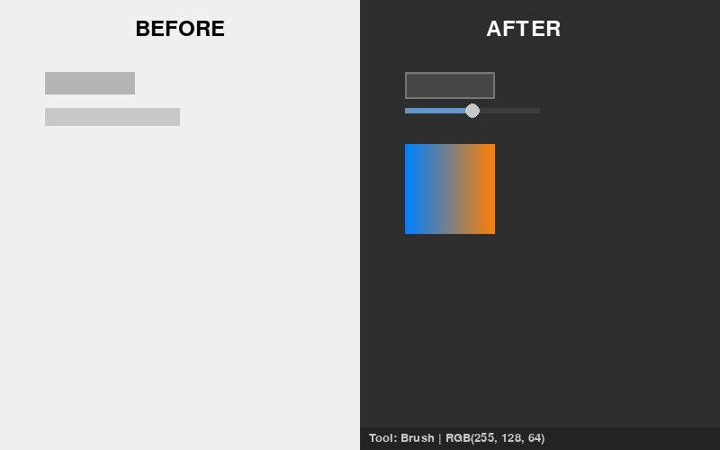

# MCSkinStudio - Modern Edition
Modern Minecraft Skin Editor in Python

MCSkinStudio (originally called MCSkin2D as a parody of MCSkin3D) has been completely modernized with a sleek dark theme and enhanced user interface while maintaining all the original functionality for editing Minecraft skins.

## ✨ Modern Features

### 🎨 Enhanced Color System
- **HSV Color Picker**: Professional color wheel with saturation/value square for precise color selection
- **Real-time Color Preview**: Large color display with modern styling
- **RGB Sliders**: Smooth, modern sliders with progress bars and hover effects
- **Color Synchronization**: All color components stay perfectly synchronized

### 🖱️ Modern User Interface
- **Dark Theme**: Professional dark background (replaces old light gray)
- **Modern Buttons**: Hover effects, gradients, and improved typography
- **Tool Palette**: Visual tool selection with interactive feedback
- **Status Bar**: Real-time display of current tool and color information
- **Professional Layout**: Better spacing, alignment, and visual hierarchy

### ⌨️ Keyboard Shortcuts
- **Ctrl+S**: Save skin
- **Ctrl+O**: Open skin file
- **Ctrl+Z**: Undo last action
- **F1**: Toggle keyboard shortcuts help panel

### 📁 Enhanced File Operations
- **File Panel**: Streamlined file management with modern buttons
- **New/Open/Save/Export**: All file operations in one convenient panel
- **Better File Dialogs**: Improved file type filtering

### 🛠️ Tool Management
- **Visual Tool Palette**: Click to select different drawing tools
- **Tool Indicators**: Current tool displayed in status bar
- **Hover Feedback**: Visual feedback for all interactive elements

## 🖼️ Visual Comparison



*Left: Original interface | Right: Modern interface*

## 🚀 Getting Started

### Prerequisites
- Python 3.6+
- pygame
- tkinter (usually included with Python)

### Installation
```bash
# Install dependencies
pip install pygame

# Clone and run
git clone https://github.com/Anonventions/MCSkinStudio.git
cd MCSkinStudio
python winmain.pyw
```

## 🎯 How to Use

1. **Drawing**: Use the main canvas to draw on your Minecraft skin
2. **Color Selection**: Use the modern HSV color picker or RGB sliders
3. **Tools**: Select different tools from the tool palette
4. **File Operations**: Use the file panel or keyboard shortcuts to save/load
5. **Help**: Press F1 to see all keyboard shortcuts

## 🔧 Technical Improvements

### Cross-Platform Compatibility
- ✅ Removed Windows-specific dependencies
- ✅ Fixed file path separators for all platforms
- ✅ Replaced Windows-only pixel capture with pygame alternatives
- ✅ Updated font loading for cross-platform compatibility

### Code Architecture
- **Modular Design**: Modern UI components in separate modules
- **Backward Compatibility**: Original components preserved
- **Clean Separation**: Modern and legacy UI can coexist

## 📝 Original Description

MCSkinStudio was originally created as a Minecraft skin editor using Python and Pygame. This modern edition maintains all the original functionality while adding contemporary UI patterns and improved usability.


## 🤝 Contributing

Feel free to contribute improvements, bug fixes, or new features! The codebase is now well-organized with modern UI components that make it easy to add new functionality.

## 📄 License

This project maintains the same open-source spirit as the original.
